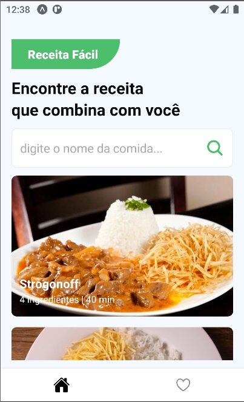
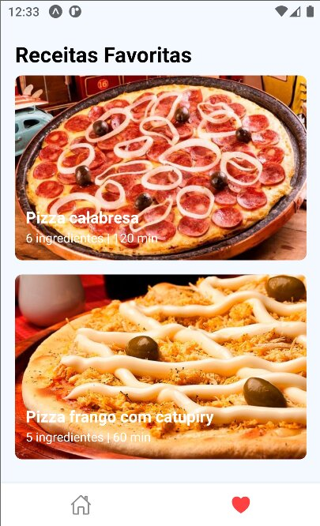

<h1 align="center"> Receita Fácil </h1>

Programa exclusivo e gratuito, promovido pelo Sujeito Programador.  

  <a href="#-tecnologias">Tecnologias</a>&nbsp;&nbsp;&nbsp;|&nbsp;&nbsp;&nbsp;
  <a href="#-projeto">Projeto</a>&nbsp;&nbsp;&nbsp;|&nbsp;&nbsp;&nbsp;
  <a href="#-layout">Layout</a>&nbsp;&nbsp;&nbsp;|&nbsp;

 

  
  

## 🚀 Tecnologias

Esse projeto foi desenvolvido com as seguintes tecnologias:

- Expo
- Typescript
- Native wind
- Git e Github
- Figma

## 💻 Projeto

Projeto feito no evento insider do @sujeitoprogramador

- :heavy_check_mark: `Funcionalidade 1:` Ver o vídeo tutorial da receita selecionada ( Usuário é redirecionado para uma pagina no Youtube ).

- :heavy_check_mark: `Funcionalidade 2:` Favoritar a receita

- :heavy_check_mark: `Funcionalidade 3:` Fazer a busca de alguma receita.

## 💻 Rodar o projeto

- Procure o local onde o projeto está e o selecione (Caso o projeto seja baixado via zip, é necessário extraí-lo antes de procurá-lo);

- Entre na pasta descompactada e rode o comando no terminal `npm install` e logo em seguida `npx expo start`

- Você pode escanear o qr code no seu aparelho, ou roda-lo no `Android Studio`

## 🔖 Layout

Você pode visualizar o layout do projeto através [DESSE LINK](https://www.figma.com/file/U5FIz9fg1qPzjNXti1oXag/App-Receita-Fácil?node-id=0-1&t=WL9xzbNbMb8Rlk5V-0). É necessário ter conta no [Figma](https://figma.com) para acessá-lo.
